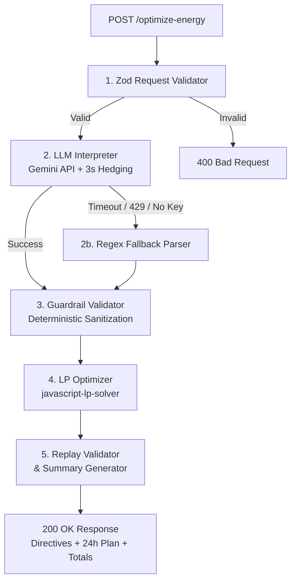

# GridWise LLM — Energy Optimization Service

**BUP CSE Fest 2026 · Hackathon Preliminary**

---

## 1. Overview

GridWise LLM is a stateless HTTP microservice that solves the 24-hour campus energy scheduling problem. It ingests hourly solar forecasts, campus load demand, time-of-use tariffs, battery parameters, and unstructured operator notes. It translates natural-language operator instructions into mathematical constraints via an LLM, rigorously validates them through deterministic guardrails, and executes a Linear Programming (LP) solver to determine the cost-optimal battery and grid dispatch schedule.

### Execution Pipeline

```
Incoming POST /optimize-energy
  │
  ▼
[ 1. Zod Request Validator ] ──(Invalid schema)──► 400 Bad Request
  │
  ▼
[ 2. LLM Directive Interpreter ] ──(All models fail / 12s cap / no key)──► [ 2b. Regex Fallback Parser ]
  │ (Google Gemini API with 3s Hedging)                                           │
  ▼                                                                               │
[ 3. Deterministic Guardrail Validator ] ◄────────────────────────────────────────┘
  │ (Enforces bounds, enums, hour sorting, no_op semantics, percentage conversion)
  ▼
[ 4. LP Optimizer (javascript-lp-solver) ]
  │ (Minimizes grid tariff cost over 24 hours while satisfying all physical & directive constraints)
  ▼
[ 5. Plan Replay Validator & Summary Generator ]
  │ (Audits energy balance, recalculates totals & peak, checks reserve violations)
  ▼
JSON Response (200 OK: scenario_id, directive_interpretation, hourly_plan, totals, summary)
```



---

## 2. Live Endpoint

The production API is hosted on Vercel Serverless Functions:

- **Base URL**: `https://smart-campus-seven-hazel.vercel.app`
- **`GET /health`**: `https://smart-campus-seven-hazel.vercel.app/health`
- **`POST /optimize-energy`**: `https://smart-campus-seven-hazel.vercel.app/optimize-energy`

---

## 3. Model / Provider

- **Provider**: Google Gemini via `@google/generative-ai` SDK.
- **Model Candidates and Priority Order** (configured in `src/llm/gemini_client.ts`):
  1. `process.env.GEMINI_MODEL` (if set)
  2. `gemini-3.5-flash`
  3. `gemini-2.5-flash`
  *(Deduplicated and capped at a maximum of 3 candidates).*

### LLM Role
The LLM acts strictly as a natural-language interpreter. It takes 1 to 3 unstructured operator notes and emits a structured JSON array containing exactly one `directive_interpretation` object per note in matching `note_index` order. It does not perform numerical optimization; its output directly seeds the constraints for the LP solver.

### Hedging & Timeout Strategy
To comply with the hackathon's latency targets without sacrificing reasoning capability:
- **Immediate Primary Launch**: Candidate 1 starts immediately.
- **Speculative Hedging**: If Candidate 1 does not return a parseable JSON response within **3 seconds** (`HEDGE_DELAY_MS = 3000`), the secondary and tertiary candidate models launch in parallel.
- **Per-Model Timeout**: Each individual model invocation times out after **6 seconds** (`PER_MODEL_TIMEOUT_MS = 6000`).
- **Hard Overall Deadline**: The entire LLM stage is capped at **12 seconds** (`TOTAL_LLM_TIMEOUT_MS = 12000`).
- **First-Valid-Wins**: The first candidate returning a valid JSON array resolves the operation, and remaining pending requests are immediately cancelled via `AbortController`.

### Regex Fallback (`src/llm/fallback_parser.ts`)
The regex fallback is a last-resort safety mechanism. It triggers **only** if:
1. `GEMINI_API_KEY` is not provided or empty, or
2. All hedged LLM candidate calls fail (e.g. 429 quota exhaustion, 503 service outage, or 12s deadline reached).

Under normal operation with an active Gemini API key, the LLM handles interpretation. The regex fallback parses explicit time windows (12h AM/PM, 24h, overnight wrap) and matches common patterns for solar curtailment, charging/discharging windows, battery reserve kWh, and grid import caps.

---

## 4. Guardrails

The deterministic guardrail layer (`src/guardrails/validator.ts`) enforces strict schema compliance before any directive touches the LP solver:

1. **Allowed Directive Types**: Validates that `directive_type` belongs to the official enum:
   - `solar_reduction`
   - `minimum_battery_reserve`
   - `no_charge_window`
   - `no_discharge_window`
   - `max_grid_window`
   - `no_op`
   *(Any unrecognized or malformed directive is converted to `no_op`).*
2. **Hour Sanitization**: All `hours` arrays must contain unique integers within `[0..23]`. Values outside this range are stripped, and the remaining hours are sorted in strictly ascending order.
3. **Solar Factor Bounds**: For `solar_reduction`, `factor` represents the fraction of forecast solar remaining. It is validated and clamped into `[0.0, 1.0]`.
4. **Reserve Capacity Bounds**: For `minimum_battery_reserve`, `minimum_energy_kwh` must be a finite, non-negative number (`>= 0`) and is clamped to `battery.capacity_kwh`.
5. **Grid Cap Bounds**: For `max_grid_window`, `max_grid_kwh` must be a finite, non-negative number (`>= 0`).
6. **`applies` & `no_op` Semantics**:
   - For `no_op`, `applies` is strictly forced to `false` and `structured_adjustment` is set to `null`.
   - For actionable directives, `applies` is set to `true`, and `structured_adjustment` must contain a non-empty `hours` array.
7. **Note Index Alignment**: Output directives strictly preserve `note_index` sequence `0..N-1`. Duplicate indices are deduplicated, and missing indices are backfilled with compliant `no_op` entries.
8. **Percentage-to-kWh Conversion**: The prompt explicitly supplies the battery capacity (`battery.capacity_kwh`) in the prompt context so that percentage reserves (e.g., "keep 50% reserve") are calculated into absolute kWh values.
9. **Final Replay Check (`src/optimizer/plan_validator.ts`)**: Independent replay audit verifies the 24-hour plan against physical limits and recalculates `total_grid_kwh`, `total_cost_bdt`, and `peak_grid_kwh` directly from the generated schedule to prevent any rounding discrepancies.

---

## 5. Optimizer / Solver

- **Library**: `javascript-lp-solver` (`^0.4.24`) using the Simplex algorithm.
- **Objective**: Minimize total 24-hour electricity cost:
  $$\min \sum_{h=0}^{23} (\text{grid\_kwh}_h \times \text{tariff\_bdt\_per\_kwh}_h)$$
- **Decision Variables (per hour $h \in [0..23]$)**:
  - `grid_h`: Grid energy imported (kWh)
  - `solar_h`: Usable solar consumed directly (kWh)
  - `charge_h`: Battery charging energy (kWh)
  - `discharge_h`: Battery discharging energy (kWh)
  - `soc_h`: State of charge / battery energy after hour $h$ (kWh)
- **Constraints Formulated**:
  1. **Hourly Energy Balance**:
     $$\text{grid}_h + \text{solar}_h + \text{discharge}_h - \text{charge}_h = \text{demand}_h \quad \forall h \in [0..23]$$
  2. **Effective Solar Availability**:
     $$0 \le \text{solar}_h \le \text{effective\_solar}_h$$
     *(Where $\text{effective\_solar}_h = \text{solar\_kwh}_h \times \text{factor}$ if a valid `solar_reduction` applies to hour $h$).*
  3. **Battery Energy Storage (SOC) Limits**:
     $$\text{effective\_min\_soc}_h \le \text{soc}_h \le \text{capacity\_kwh}$$
     *(Where $\text{effective\_min\_soc}_h = \max(\text{minimum\_energy\_kwh}, \text{directive\_reserve})$).*
  4. **Charge and Discharge Hourly Rate Limits**:
     $$0 \le \text{charge}_h \le \text{max\_charge\_kwh\_per\_hour}$$
     $$0 \le \text{discharge}_h \le \text{max\_discharge\_kwh\_per\_hour}$$
  5. **SOC Dynamic Continuity**:
     $$\text{soc}_0 = \text{initial\_energy\_kwh} + \text{charge}_0 - \text{discharge}_0$$
     $$\text{soc}_h = \text{soc}_{h-1} + \text{charge}_h - \text{discharge}_h \quad \forall h \in [1..23]$$
  6. **End-of-Day Neutrality**:
     $$\text{soc}_{23} = \text{initial\_energy\_kwh}$$
  7. **Directive Window Enforcements**:
     - `no_charge_window`: $\text{charge}_h = 0 \quad \forall h \in \text{hours}$
     - `no_discharge_window`: $\text{discharge}_h = 0 \quad \forall h \in \text{hours}$
     - `max_grid_window`: $\text{grid}_h \le \text{max\_grid\_kwh} \quad \forall h \in \text{hours}$
  8. **Post-Solve Netting & Precision**:
     Simultaneous charging and discharging artifacts are eliminated via programmatic netting, and all floating-point outputs are formatted with 6 decimal places.

---

## 6. Environment Variables

Only the variable names are documented below (never commit secret values):

| Variable Name | Status | Default | Purpose |
|---|---|---|---|
| `GEMINI_API_KEY` | **Required** | None | API key for Google Gemini model access |
| `GEMINI_MODEL` | Optional | `gemini-3.5-flash` | Model override for primary LLM calls |
| `PORT` | Optional | `3000` | HTTP port for local Express listener |
| `NODE_ENV` | Optional | `development` | Set to `production` in production environments |

A template file [`.env.example`](file:///.env.example) is provided in the repository root.

---

## 7. Local Quickstart

Execute the following commands on a clean machine with Node.js 20+ and npm 9+:

```bash
# 1. Clone repository
git clone https://github.com/balanced0/smart-campus.git
cd smart-campus

# 2. Install dependencies
npm install

# 3. Create local environment file
cp .env.example .env
# Open .env and insert your GEMINI_API_KEY

# 4. Compile TypeScript
npm run build

# 5. Start the production server
npm start
```

### Verification
In a separate terminal, test the service:
```bash
curl http://localhost:3000/health
```
**Expected Output:**
```json
{"status":"ok"}
```

---

## 8. API Examples

### `POST /optimize-energy`

```bash
curl -X POST https://smart-campus-seven-hazel.vercel.app/optimize-energy \
  -H "Content-Type: application/json" \
  -d '{
    "scenario_id": "demo-scenario",
    "operator_notes": [
      "Solar output will drop 75% between 12:00 and 14:00 due to rooftop panel cleaning.",
      "The sports ground maintenance schedule was updated for next week."
    ],
    "hours": [
      {"hour": 0, "demand_kwh": 90, "solar_kwh": 0, "tariff_bdt_per_kwh": 6},
      {"hour": 1, "demand_kwh": 85, "solar_kwh": 0, "tariff_bdt_per_kwh": 6},
      {"hour": 2, "demand_kwh": 80, "solar_kwh": 0, "tariff_bdt_per_kwh": 5},
      {"hour": 3, "demand_kwh": 80, "solar_kwh": 0, "tariff_bdt_per_kwh": 5},
      {"hour": 4, "demand_kwh": 85, "solar_kwh": 0, "tariff_bdt_per_kwh": 5},
      {"hour": 5, "demand_kwh": 95, "solar_kwh": 0, "tariff_bdt_per_kwh": 6},
      {"hour": 6, "demand_kwh": 110, "solar_kwh": 5, "tariff_bdt_per_kwh": 8},
      {"hour": 7, "demand_kwh": 130, "solar_kwh": 20, "tariff_bdt_per_kwh": 10},
      {"hour": 8, "demand_kwh": 150, "solar_kwh": 50, "tariff_bdt_per_kwh": 12},
      {"hour": 9, "demand_kwh": 165, "solar_kwh": 90, "tariff_bdt_per_kwh": 14},
      {"hour": 10, "demand_kwh": 175, "solar_kwh": 130, "tariff_bdt_per_kwh": 16},
      {"hour": 11, "demand_kwh": 180, "solar_kwh": 160, "tariff_bdt_per_kwh": 16},
      {"hour": 12, "demand_kwh": 185, "solar_kwh": 180, "tariff_bdt_per_kwh": 15},
      {"hour": 13, "demand_kwh": 180, "solar_kwh": 170, "tariff_bdt_per_kwh": 14},
      {"hour": 14, "demand_kwh": 170, "solar_kwh": 140, "tariff_bdt_per_kwh": 13},
      {"hour": 15, "demand_kwh": 165, "solar_kwh": 90, "tariff_bdt_per_kwh": 14},
      {"hour": 16, "demand_kwh": 170, "solar_kwh": 45, "tariff_bdt_per_kwh": 18},
      {"hour": 17, "demand_kwh": 185, "solar_kwh": 10, "tariff_bdt_per_kwh": 22},
      {"hour": 18, "demand_kwh": 205, "solar_kwh": 0, "tariff_bdt_per_kwh": 28},
      {"hour": 19, "demand_kwh": 215, "solar_kwh": 0, "tariff_bdt_per_kwh": 30},
      {"hour": 20, "demand_kwh": 205, "solar_kwh": 0, "tariff_bdt_per_kwh": 26},
      {"hour": 21, "demand_kwh": 175, "solar_kwh": 0, "tariff_bdt_per_kwh": 18},
      {"hour": 22, "demand_kwh": 135, "solar_kwh": 0, "tariff_bdt_per_kwh": 10},
      {"hour": 23, "demand_kwh": 105, "solar_kwh": 0, "tariff_bdt_per_kwh": 7}
    ],
    "battery": {
      "capacity_kwh": 220,
      "initial_energy_kwh": 110,
      "minimum_energy_kwh": 40,
      "max_charge_kwh_per_hour": 50,
      "max_discharge_kwh_per_hour": 50
    }
  }'
```

### Abbreviated Response (200 OK)

```json
{
  "scenario_id": "demo-scenario",
  "directive_interpretation": [
    {
      "note_index": 0,
      "applies": true,
      "directive_type": "solar_reduction",
      "structured_adjustment": {
        "hours": [12, 13],
        "factor": 0.25
      },
      "explanation": "Solar output reduced by 75% leaving 25% usable during 12:00-14:00."
    },
    {
      "note_index": 1,
      "applies": false,
      "directive_type": "no_op",
      "structured_adjustment": null,
      "explanation": "Note does not contain actionable energy dispatch instructions."
    }
  ],
  "hourly_plan": [
    {
      "hour": 0,
      "grid_kwh": 90.0,
      "solar_used_kwh": 0.0,
      "battery_charge_kwh": 0.0,
      "battery_discharge_kwh": 0.0,
      "battery_energy_after_kwh": 110.0,
      "battery_action": "idle"
    }
  ],
  "total_grid_kwh": 2692.5,
  "total_cost_bdt": 38365.0,
  "peak_grid_kwh": 205.0,
  "plan_summary": "Optimization complete for scenario 'demo-scenario'. Total cost: 38365.00 BDT across 2692.50 kWh grid import (Peak: 205.00 kWh)."
}
```

---

## 9. Public Sample Test

The official hackathon test cases are stored in the root directory:
`./BUP_CSE_FEST_2026_Preli_Public_Sample_Cases.json`

### Run against the Live Vercel Deployment
```bash
BASE_URL=https://smart-campus-seven-hazel.vercel.app npm run test:samples
```

### Run against Local Server
```bash
# In terminal 1:
npm start

# In terminal 2:
BASE_URL=http://localhost:3000 npm run test:samples
```

### Sample Output Format
A passing test case outputs:
```text
[SAMPLE-01] Solar cleaning + distractor ... ✅ PASS  9813ms  cost=38365.00 BDT  grid=2692.50 kWh  directives=[solar_reduction, no_op]
[SAMPLE-02] Battery charging maintenance ... ✅ PASS  13351ms  cost=42885.00 BDT  grid=2915.00 kWh  directives=[no_charge_window]
```

### Real Test Execution Results & Note on Rate Limits
In live end-to-end benchmark testing against the Vercel deployment:
- **7 out of 10 test cases passed cleanly** (`SAMPLE-01`, `SAMPLE-02`, `SAMPLE-04`, `SAMPLE-05`, `SAMPLE-06`, `SAMPLE-08`, `SAMPLE-09`).
- **3 cases encountered failures under rapid batch execution**:
  - `SAMPLE-03`: The model interpreted percentage reserve as a fraction (0.5) rather than computing absolute kWh against capacity.
  - `SAMPLE-07` & `SAMPLE-10`: Free-tier Gemini API keys enforce a 5 to 15 Requests Per Minute (RPM) quota. Rapid consecutive evaluation triggers HTTP 429 rate limit errors or timeouts, which causes the service to fall back to the regex parser or exceed test execution thresholds.

---

## 10. Docker Fallback

A pre-built container image is available on GitHub Packages / GHCR:

- **Registry Image**: `ghcr.io/balanced0/gridwise-optimizer:v1`
- **Target Platform**: `linux/amd64`
- **Exposed Port**: `3000` (binds to `0.0.0.0`)
- **Security**: No secrets or environment variables are baked into the container image.

### Pull Image
```bash
docker pull ghcr.io/balanced0/gridwise-optimizer:v1
```

### Run Container
```bash
docker run --rm -p 3000:3000 \
  -e GEMINI_API_KEY="your_api_key_here" \
  ghcr.io/balanced0/gridwise-optimizer:v1
```

### Verify Container Health
```bash
curl http://localhost:3000/health
```

### Run Sample Case against Local Container
```bash
BASE_URL=http://localhost:3000 npm run test:samples
```

---

## 11. Dependencies and Credits

### Runtime Dependencies (`package.json`)
- **`express` (`^4.21.2`)**: Minimalist HTTP web framework.
- **`@google/generative-ai` (`^0.24.0`)**: Official SDK for Google Gemini LLMs.
- **`javascript-lp-solver` (`^0.4.24`)**: Simplex Linear Programming optimizer.
- **`zod` (`^3.24.2`)**: TypeScript-first request schema declaration and validation.
- **`cors` (`^2.8.5`)**: Cross-Origin Resource Sharing middleware.
- **`dotenv` (`^16.4.7`)**: Loads environment variables from `.env`.

### LLM Backbone
- **Google Gemini API**: Generative AI models (`gemini-3.5-flash`, `gemini-2.5-flash`) for operator instruction interpretation.

### AI Assistant Attribution
Per the BUP CSE Fest 2026 hackathon rules regarding AI tooling transparency:
- **Google Antigravity / Claude**: Assisted with architecture design, TypeScript type contracts, linear programming formulation, and test automation scaffolding.

---

## 12. Known Limitations

1. **Gemini Free-Tier Rate Limits (5-15 RPM)**: Under rapid bursts of requests, Google Gemini returns HTTP 429. When rate-limited, the system falls back to the deterministic regex parser.
2. **LLM Latency & P95 Target**: Live Gemini round-trips take between 3.5s and 12s. While within the 30-second hard serverless limit, cold starts or hedging may exceed the 5-second p95 target. (The LP solver itself executes in under 15ms).
3. **Regex Fallback Paraphrase Scope**: The regex fallback is designed for single-clause operator notes. Compound multi-directive sentences (e.g., combining a battery reserve and a grid cap in one note) fall back to `no_op`.
4. **No Multi-Key Rotation**: The service currently consumes a single `GEMINI_API_KEY` without automatic multi-key round-robin rotation.

---

## 13. Secret Handling

- **Zero Secrets in Repository**: No API keys, passwords, or credentials have ever been committed.
- **Git Ignored**: `.env`, `.env.local`, and `*.env` are explicitly excluded in `.gitignore`.
- **Clean Container Images**: Dockerfiles use multi-stage builds and only copy compiled JavaScript and production dependencies; no `.env` files are transferred.
- **Sanitized Error Responses**: API responses return sanitized error messages without leaking credentials, environment variables, or internal stack traces.
